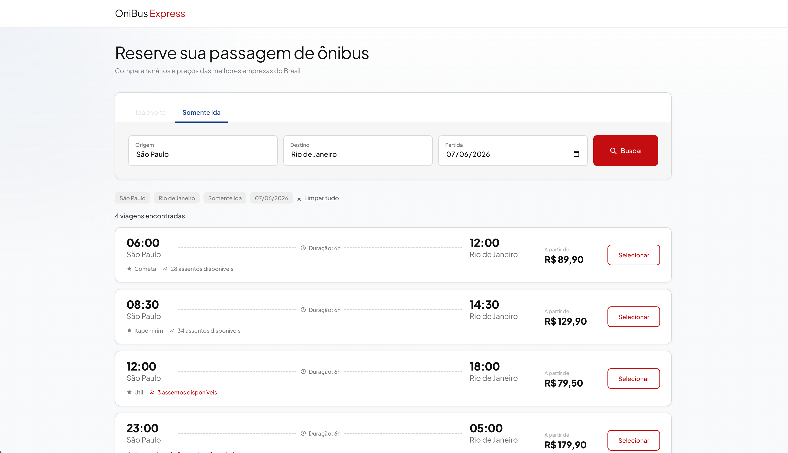
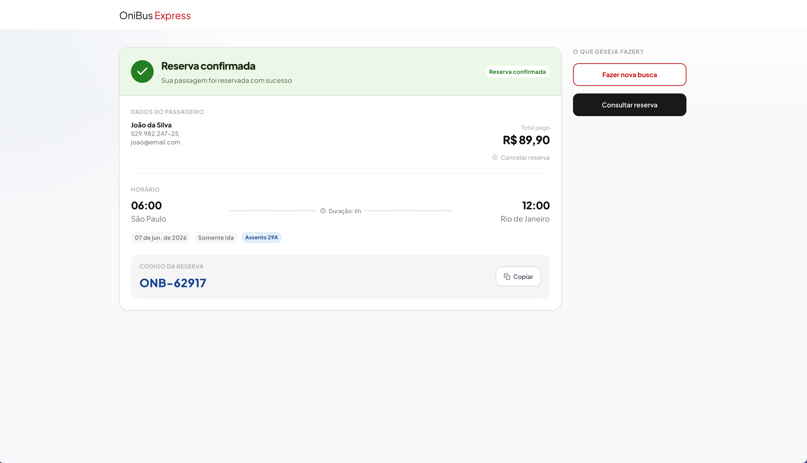
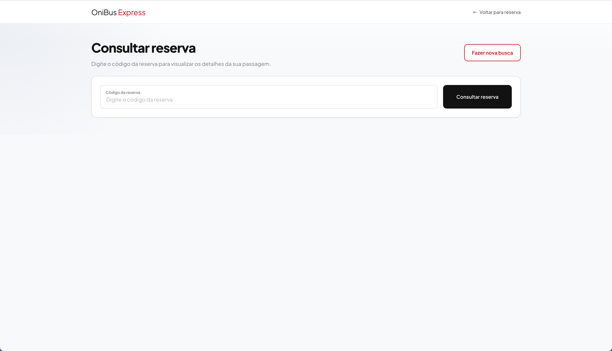
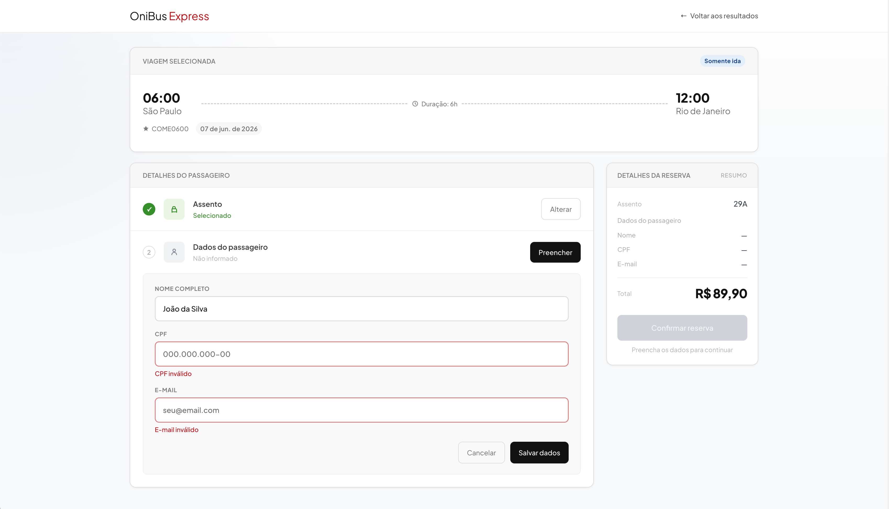
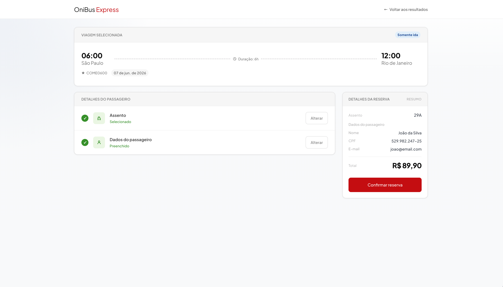
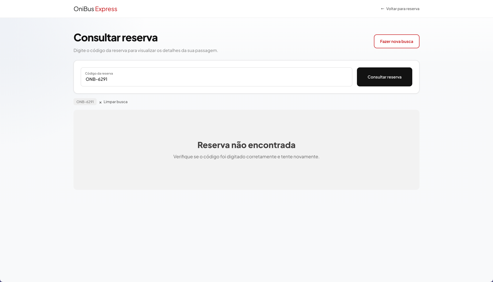
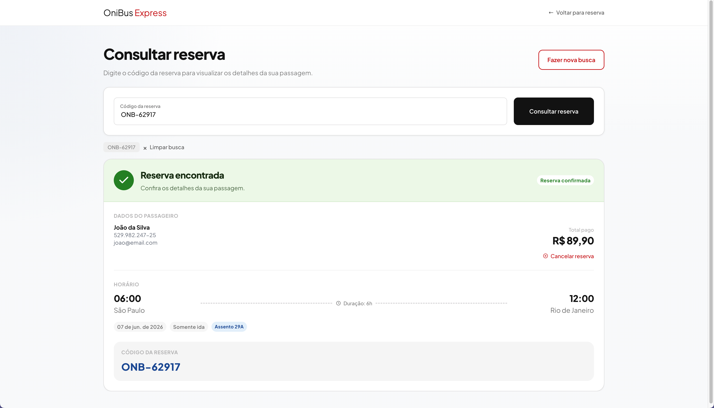
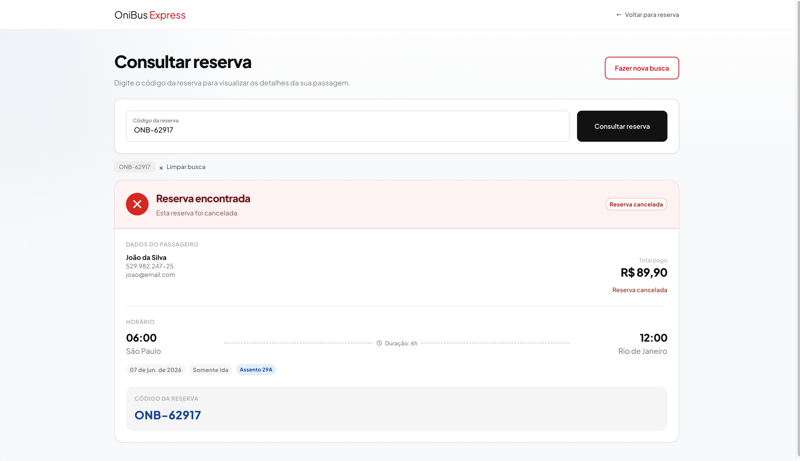

# OniBus Express

## Screenshots

### Fluxo principal

#### Busca de viagens

#### Detalhes da viagem selecionada

#### Seleção de assento

#### Reserva confirmada

#### Consulta de reserva

### Galeria completa

Ver mais telas do fluxo

#### Tela inicial de busca

#### Estado vazio da busca

#### Resumo com assento selecionado

#### Validação dos dados do passageiro

#### Resumo com dados preenchidos

#### Reserva encontrada

#### Reserva não encontrada

#### Confirmação de cancelamento

#### Cancelamento em confirmação

#### Cancelamento confirmado

#### Validação da busca

