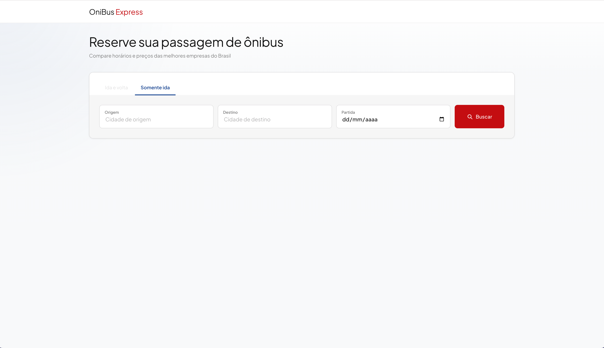
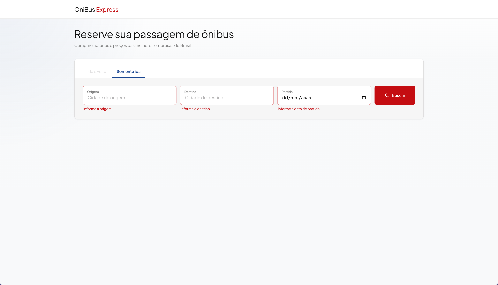
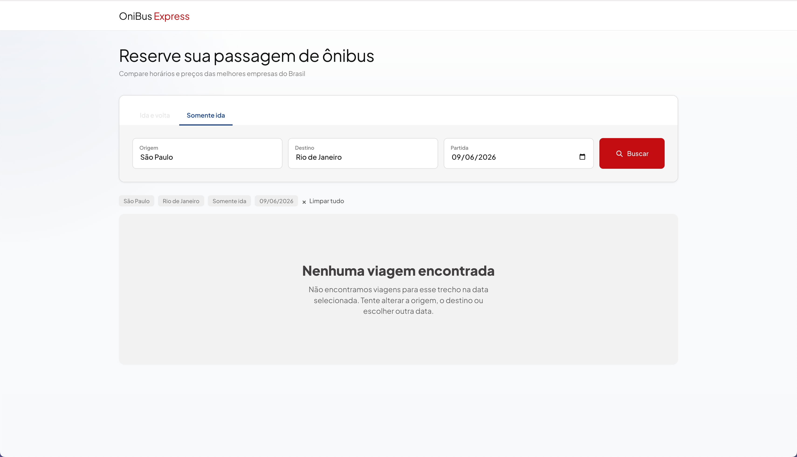
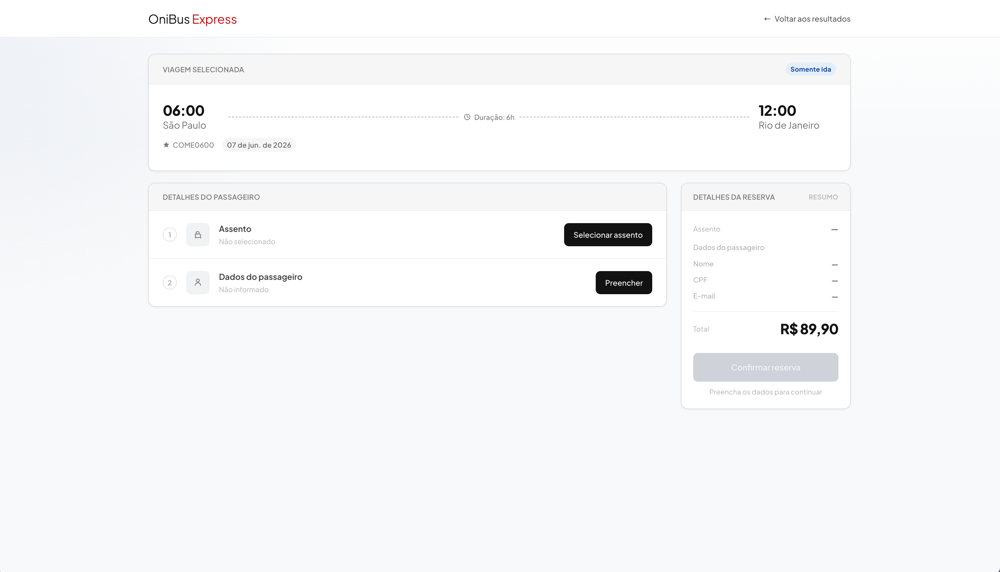
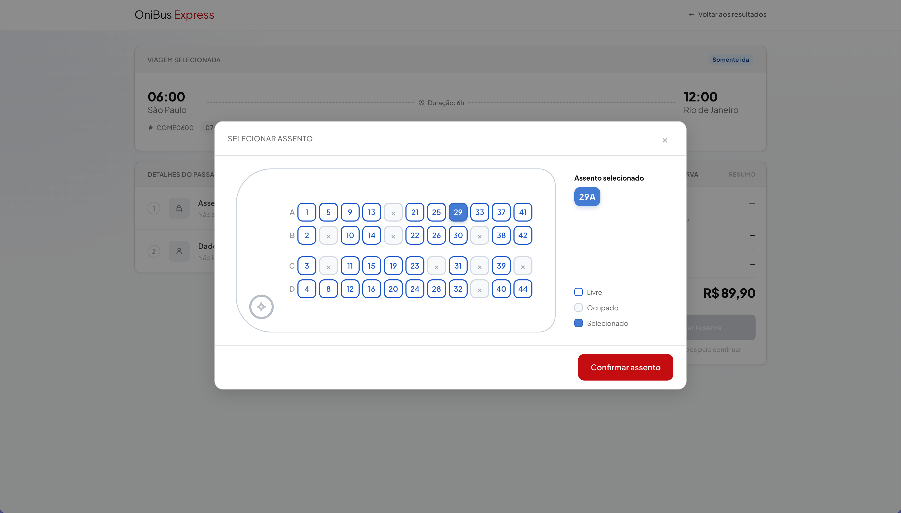
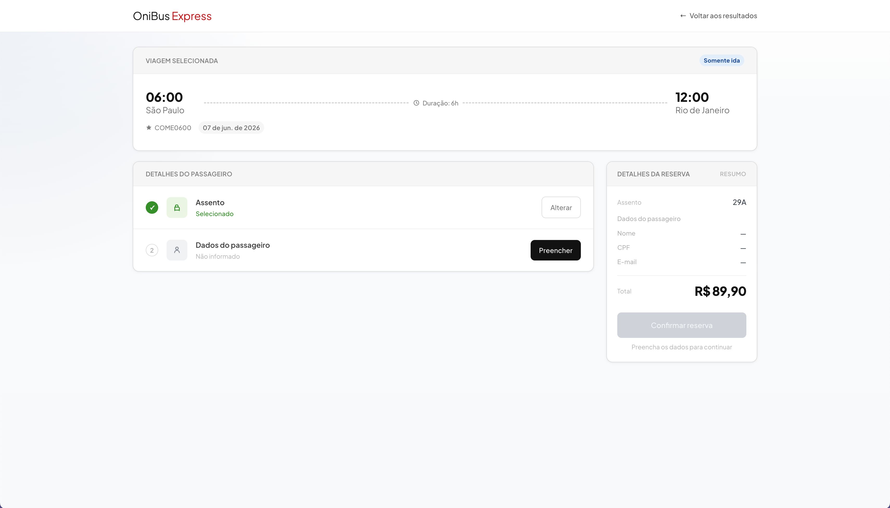
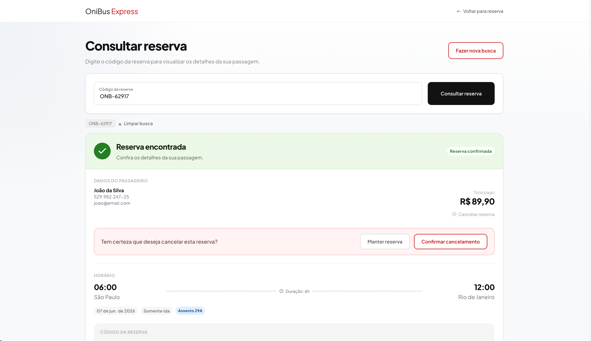

# OniBus Express

Projeto do desafio OniBus Express com frontend em React/Vite e backend em .NET 8 Web API.

Nesta versão, priorizei a entrega completa do fluxo visual no frontend e iniciei a estrutura full stack com backend .NET, PostgreSQL, Swagger e integração da busca de viagens com a API. A listagem de viagens já pode ser validada localmente via `GET /api/viagens`. A persistência de reservas no backend ficou como próximo passo.

## Demo online

O frontend está publicado na Vercel para facilitar a avaliação visual do fluxo:

https://onibus-express.vercel.app/

A demo online tem foco na experiência do frontend. Como o backend .NET com PostgreSQL não está publicado em produção nesta versão, a aplicação usa dados locais como fallback quando está rodando na Vercel.

Para validar a integração full stack com backend, API, PostgreSQL e Swagger, siga as instruções de execução local deste README.

## Tecnologias utilizadas

### Frontend
- React
- TypeScript
- Vite
- CSS
- Fetch API

### Backend
- .NET 8 Web API
- Entity Framework Core
- PostgreSQL
- Docker Compose
- Swagger / OpenAPI

## Estrutura de pastas

```text
onibus-express/
├── backend/
│   ├── OnibusExpress.Api/
│   ├── OnibusExpress.Tests/
│   ├── OnibusExpress.sln
│   └── docker-compose.yml
├── frontend/
│   ├── src/
│   ├── public/
│   ├── package.json
│   └── .env.example
└── README.md
```

## Funcionalidades implementadas no frontend

- Tela de busca de passagens
- Listagem de viagens
- Integração da busca com `GET /api/viagens`
- Checkout visual da viagem selecionada
- Seleção de assento
- Formulário de dados do passageiro
- Confirmação visual da reserva
- Tela de reserva confirmada
- Tela de consulta de reserva
- Fluxo visual de cancelamento de reserva no frontend

## Funcionalidades implementadas no backend

- API .NET 8 estruturada com Entity Framework Core
- `AppDbContext` com entidades iniciais de viagem e reserva
- Seed inicial de viagens
- PostgreSQL via Docker Compose
- Swagger habilitado em ambiente de desenvolvimento
- Endpoints disponíveis para consulta de viagens

## Integração frontend + backend

O frontend consome o endpoint `GET /api/viagens` para carregar a lista de viagens disponíveis. A filtragem por origem, destino e data é aplicada no frontend após o retorno da API.

No ambiente local, a aplicação tenta consumir a API em `http://localhost:5153` quando `VITE_API_URL` não estiver configurada. Na demo online publicada na Vercel, como o backend não está disponível em produção nesta versão, o frontend usa os dados locais como fallback para manter a navegação funcional.

## Dados para teste

Para testar o fluxo visual de reserva, você pode usar os dados abaixo:

```txt
Origem: São Paulo
Destino: Rio de Janeiro
Data: 07/06/2026
Nome: João da Silva
CPF: 529.982.247-25
E-mail: joao@email.com
```

O CPF acima é um dado fictício usado apenas para teste.

## Escopo entregue

Nesta versão, priorizei:

- o fluxo visual completo no frontend;
- a base inicial do backend com .NET 8, Entity Framework Core e PostgreSQL;
- o seed de viagens;
- a documentação e validação dos endpoints via Swagger;
- a integração da busca de viagens entre frontend e backend.

O backend de reservas ainda não está concluído. Ou seja: a experiência visual de reserva, consulta e cancelamento já existe no frontend, mas a persistência dessas ações no backend ficou como próximo passo.

## Como rodar o backend

```bash
cd backend
docker compose up -d
dotnet run --project OnibusExpress.Api
```

## URL do Swagger

[http://localhost:5153/swagger](http://localhost:5153/swagger)

## Endpoints disponíveis

- `GET /api/viagens`
- `GET /api/viagens/{id}`

## Como rodar o frontend

```bash
cd frontend
npm install
npm run dev
```

## URL do frontend

[http://localhost:5173](http://localhost:5173)

## Variável de ambiente

Crie um `.env` local a partir do exemplo, se necessário:

```env
VITE_API_URL=http://localhost:5153
```

## Como validar a integração

1. Em um terminal, suba o backend:

```bash
cd backend
docker compose up -d
dotnet run --project OnibusExpress.Api
```

2. Abra o Swagger em:

http://localhost:5153/swagger

3. Em outro terminal, rode o frontend:

```bash
cd frontend
npm install
npm run dev
```

4. Acesse:

http://localhost:5173

5. Busque `São Paulo` → `Rio de Janeiro` na data `07/06/2026`.

6. Para confirmar a integração, abra o DevTools do navegador, vá em `Network > Fetch/XHR` e confira a chamada `GET /api/viagens` com status `200`.

## Como rodar builds

### Backend

```bash
cd backend
dotnet build
```

### Frontend

```bash
cd frontend
npm run build
```

## Status da implementação

- Implementado: frontend com fluxo visual completo de busca, reserva, consulta e cancelamento, backend inicial, Docker/PostgreSQL, Swagger, integração de busca de viagens
- Parcial: persistência de reservas no backend ainda não finalizada

## Próximos passos

- `POST /api/reservas`
- `GET /api/reservas/{codigo}`
- `DELETE /api/reservas/{codigo}`
- persistir confirmação, consulta e cancelamento de reservas no backend
- impedir reserva duplicada do mesmo assento no backend
- testes unitários
- publicar o backend em ambiente online, caso seja necessário validar a integração completa fora do ambiente local

## Screenshots

### 1. Tela inicial — busca de viagem

Tela inicial com formulário para origem, destino e data da viagem.



### 2. Validação da busca

Validação dos campos obrigatórios ao acionar o botão Buscar sem preencher os dados.



### 3. Resultado não encontrado

Estado vazio exibido quando não há viagens para o trecho e data pesquisados.



### 4. Resultado encontrado

Lista de viagens encontradas para São Paulo → Rio de Janeiro em 07/06/2026.


### 5. Detalhe da reserva

Após clicar em uma viagem, o usuário acessa a tela de detalhe com a viagem selecionada.



### 6. Seleção do assento

Modal de seleção de assento, com estados de assentos livres, ocupados e selecionados.



### 7. Resumo com assento selecionado

Checkout exibindo o assento escolhido antes do preenchimento dos dados do passageiro.



### 8. Validação de CPF e e-mail

Exemplo de validação dos campos de CPF e e-mail no formulário de dados do passageiro.


### 9. Resumo com dados do passageiro

Checkout com assento e dados do passageiro preenchidos, liberando a confirmação da reserva.


### 10. Confirmação da reserva

Tela de sucesso com resumo da reserva, código gerado e botão para copiar o código.


### 11. Consulta da reserva

Tela para consultar uma reserva pelo código.


### 12. Reserva não encontrada

Estado vazio exibido quando o código de reserva não é localizado.


### 13. Reserva encontrada

Resultado da consulta exibindo os detalhes de uma reserva confirmada.


### 14. Início do cancelamento da reserva

Estado em que o usuário solicita o cancelamento da reserva.


### 15. Confirmação do cancelamento

Mensagem de confirmação antes de finalizar o cancelamento da reserva.



### 16. Reserva cancelada

Estado visual da reserva após a confirmação do cancelamento.


